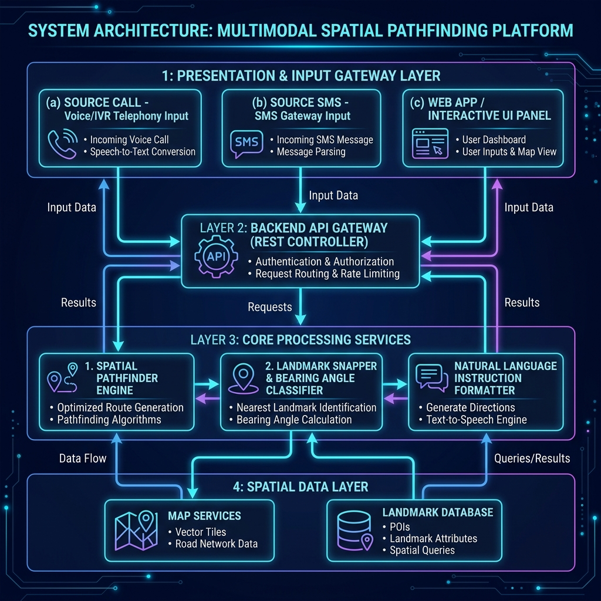
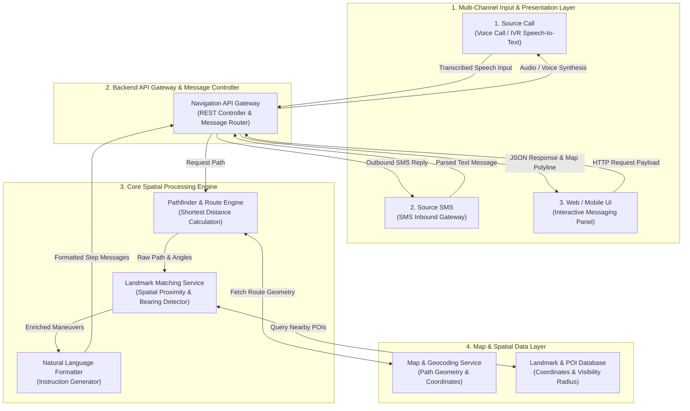
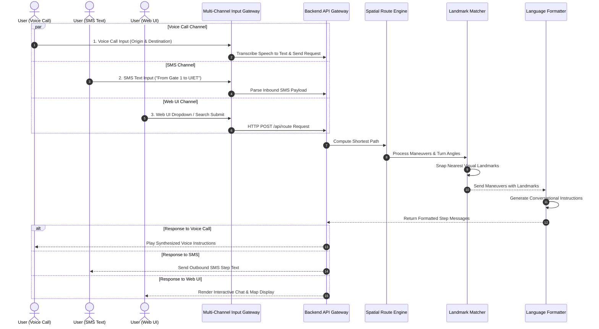

# System Architecture & Workflow Report — Landmark Navigation System

## 1. Executive Summary & Overview

This document presents the system architecture and multi-channel data workflow for the **Landmark-Based Message Navigation System**. The platform transforms standard spatial coordinates and route geometry into intuitive, human-friendly turn-by-turn messages guided by physical landmarks (e.g., *"Walk 200m towards Administrative Building and then take a left turn there"*).

The system supports multi-channel user inputs, accepting navigation requests via **Voice Phone Calls (IVR Telephony)**, **SMS Text Messages**, and the **Interactive Web Application UI Panel**.

---

## 2. High-Level System Architecture Diagram

---

## 3. Sequential Data Flow Diagram (Multi-Channel Inputs)

---

## 4. Input Sources Breakdown

1. **Source 1: Voice Call Gateway (`Source Call`)**:
   - Accepts inbound phone calls via Telephony / IVR Gateway.
   - Transcribes spoken origin and destination using Speech-to-Text (STT) into structured spatial queries.
   - Synthesizes output instructions into spoken voice guidance for the caller.

2. **Source 2: SMS Gateway (`Source SMS`)**:
   - Accepts inbound SMS text messages (e.g., *"Route from Gate 1 to UIET"*).
   - Parses location keywords and transmits back compact, landmark-oriented SMS step text messages.

3. **Source 3: Web / Mobile Application Panel (`Web UI`)**:
   - Provides a rich, interactive split-screen interface with real-time dropdown/search autocomplete, animated chat message bubbles, and a synchronized interactive map.

---

## 5. Processing Pipeline & Algorithm Details

### Phase 1: Spatial Path Calculation
- The system receives the starting point and final destination from any input channel.
- The **Pathfinder Engine** queries spatial nodes and calculates the shortest distance trajectory connecting the two points.

### Phase 2: Bearing Angle & Turn Classification
- For every decision point along the path, the system calculates forward azimuth heading vectors:
$$\theta = \text{atan2}(\sin(\Delta \lambda) \cdot \cos(\phi_2), \cos(\phi_1) \cdot \sin(\phi_2) - \sin(\phi_1) \cdot \cos(\phi_2) \cdot \cos(\Delta \lambda))$$
- Heading changes ($\Delta \theta$) are classified into relative maneuvers:
  - $\Delta \theta \approx 0^\circ \rightarrow$ **Walk Straight**
  - $\Delta \theta \in [+25^\circ, +120^\circ] \rightarrow$ **Turn Right**
  - $\Delta \theta \in [-120^\circ, -25^\circ] \rightarrow$ **Turn Left**

### Phase 3: Spatial Landmark Matching
- The **Landmark Matcher** executes a spatial proximity lookup around each turn node within a predefined visibility radius ($r \le 50\text{m}$).
- The most prominent visual landmark near the decision node is assigned to that turn step.

### Phase 4: Natural Language Instruction Formatting
- Step maneuvers, distance metrics, and snapped landmark names are formatted into clear human instructions:
$$\text{Instruction} = \text{"Walk "} + \text{Distance} + \text{"m till "} + \text{Landmark Name} + \text{" and then take a "} + \text{Turn Direction} + \text{" turn."}$$

### Phase 5: Multi-Channel Output Dispatch
- Results are dispatched back to the requesting source channel: Voice audio for Calls, compact text for SMS, and interactive chat + map polyline for Web UI.
